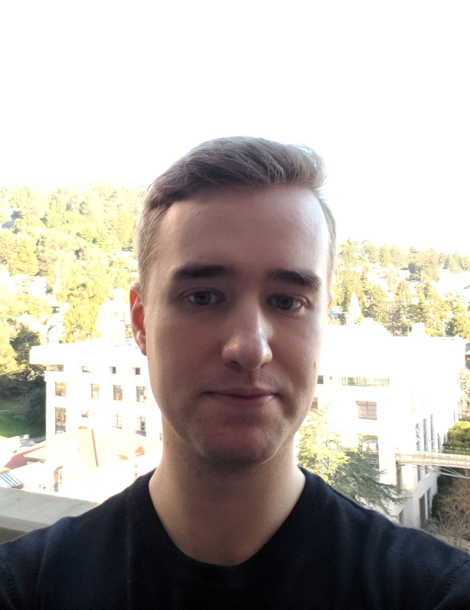

<html lang="en">
<head>
  <meta charset="UTF-8">
  <meta name="viewport" content="width=device-width, initial-scale=1">
  <title>Ben Pineau</title>
  <link rel="canonical" href="https://bpineau2.github.io/">
  <meta property="og:title" content="Ben Pineau">
  <meta property="og:site_name" content="Ben Pineau">
  <meta property="og:url" content="https://bpineau2.github.io/">
  <meta property="og:type" content="website">
  <meta name="twitter:card" content="summary">
  <meta name="twitter:title" content="Ben Pineau">
  <link rel="stylesheet" href="/assets/css/style.css">
  
</head>
<body>
  <main class="container-lg px-3 my-5 markdown-body">
    <header class="profile-header">
      
      <h1>Ben Pineau</h1>
      
I am currently a Simons Junior Fellow in <a href="https://www.simonsfoundation.org/simons-society-of-fellows/">the Simons Society of Fellows</a> and am hosted by the <a href="https://cims.nyu.edu/dynamic/">Courant Institute of Mathematical Sciences</a> in New York City. My mentor is <a href="https://cims.nyu.edu/~vicol/">Vlad Vicol</a>. Here is my <a href="Pineau_CV (9).pdf">CV.</a>

      
My email is brp305@nyu.edu

      
I study nonlinear PDE. My research interests are generally in physically motivated models, some of which include Schrödinger equations, free boundary Euler equations, water waves, and the equations of magnetohydrodynamics. I am also interested in stable phase retrieval.

      
I received my PhD in 2024 from the mathematics department at UC Berkeley. My advisor was <a href="https://math.berkeley.edu/~tataru/">Daniel Tataru</a>. My dissertation can be viewed <a href="Finalized.pdf">here.</a>

    </header>
    <h2>Publications and preprints</h2>
    <ol class="publications" reversed>
<li><i>Global well-posedness for non-localized 3D gravity water waves</i>, joint with Mihaela Ifrim and Daniel Tataru. In final preparation.</li>
<li><i>On rotated backwards self-similar solutions of the incompressible 3D Navier-Stokes equations,
</i> joint with Vlad Vicol <a href="https://arxiv.org/abs/2607.09619">arXiv:2607.09619 [math.AP]</a></li>
	<li><i>L2-Stability for STFT phase retrieval,
</i> joint with Susanna Bertolini, Jaume de Dios Pont, Mitchell Taylor and João Ramos <a href="https://arxiv.org/abs/2605.20527">arXiv:2605.20527 [math.FA]</a></li>
	<li><i>Cheeger’s constant for the Gabor transform and ripples,
</i> joint with Rima Alaifari, Mitchell Taylor and Matthias Wellershoff. <a href="https://arxiv.org/abs/2512.18058">arXiv:2512.18058 [math.CA]</a></li>
	<li><i>A Poisson formula for the wave propagator on Schwarzschild-de Sitter backgrounds,
</i> joint with Izak Oltman. <a href="https://arxiv.org/abs/2512.16054">arXiv:2512.16054 [math.AP]</a></li>
			<li><i>On the optimal Sobolev threshold for evolution equations with rough nonlinearities</i>, joint with Mitchell Taylor, accepted in <b>Journal of the European Mathematical Society</b>. <a href="https://arxiv.org/abs/2505.14966">arXiv:2505.14966 [math.AP]</a></li>
<li><i>Global solutions for cubic quasilinear ultrahyperbolic Schrödinger flows</i>, joint with Mihaela Ifrim and Daniel Tataru, accepted in <b>Duke Mathematical Journal.</b> <a href="https://arxiv.org/abs/2504.06230">arXiv:2504.06230 [math.AP]</a></li>
<li><i>Sharp well-posedness for the free boundary MHD equations</i>, joint with Mihaela Ifrim, Daniel Tataru, and Mitchell Taylor. <a href="https://arxiv.org/abs/2412.15625">arXiv:2412.15625 [math.AP]</a></li>
<li><i>Sharp Hadamard local well-posedness, enhanced uniqueness, and pointwise continuation criterion for the incompressible free boundary Euler equations</i>, joint with Mihaela Ifrim, Daniel Tataru, and Mitchell Taylor, accepted in <b>Annals of PDE</b>. <a href="https://arxiv.org/abs/2309.05625">arXiv:2309.05625 [math.AP]</a></li>
			<li><i>Low regularity solutions for the general quasilinear ultrahyperbolic Schrödinger equation</i>, joint with Mitchell Taylor, accepted in <b>Archive for Rational Mechanics and Analysis</b>. <a href="https://arxiv.org/abs/2310.19221">arXiv:2310.19221 [math.AP]</a></li>
			<li><i>Stable phase retrieval in function spaces</i>, joint with Daniel Freeman, Timur Oikhberg, and Mitchell Taylor, accepted in <b>Math. Ann.</b> <a href="https://arxiv.org/abs/2210.05114">arXiv:2210.05114 [math.FA]</a></li>
			<li><i>Examples of Hölder-Stable Phase Retrieval</i>, joint with Michael Christ and Mitchell Taylor, accepted in <b>Math. Res. Lett.</b> <a href="https://arxiv.org/abs/2205.00187">arXiv:2205.00187 [math.CA]</a></li>
<li><i>Global well-posedness for the generalized derivative nonlinear Schrödinger equation</i>, joint with Mitchell Taylor, accepted in <b>Nonlinearity.</b> <a href="https://arxiv.org/abs/2112.04648">arXiv:2112.04648 [math.AP]</a></li>
						<li><i>No pure capillary solitary waves exist in 2D finite depth</i>, joint with Mihaela Ifrim, Daniel Tataru and Mitchell Taylor, accepted in <b>SIAM J. Math. Anal.</b> <a href="https://arxiv.org/abs/2104.07845">	arXiv:2104.07845 [math.AP]</a></li>
			<li><i>On Prodi–Serrin type conditions for the 3D Navier–Stokes equations</i>, joint with Xinwei Yu, <b>Nonlinear Analysis</b>. Vol. 190, (2020). <a href="https://www.sciencedirect.com/science/article/abs/pii/S0362546X19302573">link</a></li>
			<li><i>A New Prodi–Serrin Type Regularity Criterion in Velocity Directions</i>, joint with Xinwei Yu, <b>Journal of Mathematical Fluid Mechanics</b>. Vol. 20, pages 1737–1744 (2018). <a href="https://link.springer.com/article/10.1007%2Fs00021-018-0388-z">link</a></li>
<li><i>New Regularity Criteria for the Navier-Stokes Equations in Terms of Pressure</i>, joint with Xinwei Yu. <a href="https://arxiv.org/abs/1910.08911">arXiv:1910.08911 [math.AP]</a></li>
    </ol>
    <h2>Invited Talks and Conference Participation</h2>
    <ul>
<li><i>BIRS Workshop: Dynamics in Geometric Dispersive Equations and the effects of Trapping, Scattering and weak Turbulence, III</i>. November 29 - December 4, 2026. Banff, Canada.</li>
<li><i>UC Berkeley Analysis and PDE seminar</i>. November 16th, 2026. UC Berkeley, Berkeley, CA, USA.</li>
<li><i>Caltech Analysis seminar</i>. November 13th, 2026. Caltech, Los Angeles, CA, USA.</li>
<li><i>Workshop on "Phase Retrieval: Connecting Theory and Applications</i>. Sept. 21-25, 2026. RWTH Aachen University, Aachen, Germany.</li>
<li><i>2026 SUMIRFAS Seminar</i>. July 31-August 2, 2026. Texas A&amp;M in College Station, Texas, USA.</li>
<li><i>Northwestern Analysis Seminar</i>. May 25th, 2026. Northwestern University, Chicago, IL, USA.</li>
<li><i>Courant Analysis Seminar</i>. April 23rd, 2026. NYU Courant, New York City, NY, USA.</li>
<li><i>AMS Spring Central Sectional Meeting on Nonlinear Waves</i>. April 18-19, 2026. North Dakota State University, Fargo, ND, USA.</li>
<li><i>Rutgers Hyperbolic &amp; Dispersive PDE Seminar</i>. April 2nd, 2026. Rutgers University, New Brunswick, NJ, USA.</li>
<li><i>Courant Student Analysis Seminar</i>. March 30th, 2026. NYU Courant, New York City, NY, USA.</li>
<li><i>Oberwolfach workshop: Nonlinear Waves and Dispersive Equations</i>. March 1-6, 2026. Oberwolfach, Germany.</li>
<li><i>Yale Analysis seminar</i>. November 20th, 2025. Yale University, New Haven, CT, USA.</li>
<li><i>The 21st Prairie Analysis Seminar</i>. November 7-8, 2025. Kansas State University, Manhatthan, KS, USA.</li>
<li><i>Second Atlantic Conference in Nonlinear PDEs</i>. November 3-7, 2025. Instituto Superior Técnico - Universidade de Lisboa, Lisbon, Portugal.</li>
<li><i>Princeton Analysis seminar</i>. November 3rd, 2025. Princeton University, Princeton, NJ, USA.</li>
<li><i>Conference on Nonlinear Dispersive Equations: Advances and Perspectives</i>. May 12-16, 2025. Centre National de la Recherche Scientifique, Marseille, France.</li>
<li><i>Plenary speaker at FIM Workshop on Phase Retrieval and Banach Lattices</i>. May 5-9, 2025. ETH, Zurich, Switzerland.</li>
<li><i>Simons Society of Fellows Retreat</i>. March 31-April 2, 2025. Savannah, Georgia, USA.</li>
<li><i>Conference on Mathematics of Wave Phenomena</i>. February 24-28, 2025. KIT, Karlsruhe, Germany.</li>
<li><i>Calderón-Zygmund Analysis Seminar</i>. Dec. 2nd, 2024. University of Chicago, Chicago, IL, USA.</li>
<li><i>Courant Analysis Seminar</i>. Sept. 19th, 2024. NYU Courant, New York City, NY, USA.</li>
<li><i>Plenary speaker at <a href="https://www.icmat.es/RT/2024/LSAA/program.php?fbclid=IwAR1QZkhmUYGH9fMrEftzM0yhufJ7VD6Ry3G-l5eHUgm78lX1rjBDaKT6-Vg#FW1">Lattice Structures in Analysis and Applications Conference</a></i>. May 6-10, 2024. ICMAT, Madrid, Spain.</li>
<li><i>AMS Spring Central Sectional Meeting on Nonlinear Waves</i>. April 20-21, 2024. University of Wisconsin-Milwaukee, Milwaukee, WI, USA.</li>
<li><i>UCLA Analysis and PDE seminar</i>. November 28th, 2023. UCLA, Los Angeles, CA, USA.</li>
<li><i>Oberwolfach seminar: Scattering Resonances in Quantum Mechanics, General Relativity and Hyperbolic Dynamics </i>. November, 2023. Oberwolfach, Germany.</li>
<li><i>ETH Zurich Analysis seminar</i>. Nov. 14th, 2023. ETH, Zurich, Switzerland.</li>
<li><i>UC Berkeley Analysis and PDE seminar</i>. Sept. 25th, 2023. UC Berkeley, Berkeley, CA, USA.</li>
<li><i>MSRI, FD2 Reunion seminar</i>. August 10th, 2023. Simons Laufer Mathematical Sciences Institute, Berkeley, CA, USA.</li>
<li><i>Wisconsin PDE seminar</i>. April. 24th, 2023. University of Wisconsin–Madison, Madison, WI, USA.</li>
<li><i>ICMAT PDE’s and Fluid Mechanics seminar</i>. Nov. 3rd, 2022. ICMAT, Madrid, Spain.</li>
<li><i>Oberwolfach seminar: Free Boundary Problems in Fluid Dynamics </i>. October, 2022. Oberwolfach, Germany.</li>
<li><i> Harmonic Analysis and Differential Equations Seminar (HADES)</i>. May 10th, 2022. UC Berkeley, Berkeley, CA, USA.</li>
<li><i>PDE Learning Seminar (Fall 2021)
				Nonlinear wave equations and general relativity</i>. Nov. 3rd, 2021; via Zoom. UC Berkeley, Berkeley, CA, USA.</li>
<li><i> Harmonic Analysis and Differential Equations Seminar (HADES)</i>. Oct. 26th, 2021. UC Berkeley, Berkeley, CA, USA.</li>
<li><i>MSRI, Mathematical problems in fluid dynamics graduate student working group</i>. May. 12th, 2021; via Zoom. MSRI, CA, USA.</li>
<li><i>Seminar on wave packets in dispersive PDE</i>. Nov. 17th, 2020; via Zoom. UC Berkeley, Berkeley, CA, USA.</li>
<li><i>Seminar on singularity formation for incompressible Euler</i>. Mar, 2020. UC Berkeley, Berkeley, CA, USA.</li>
<li><i> Harmonic Analysis and Differential Equations Seminar (HADES)</i>. Nov. 19th, 2019. UC Berkeley, Berkeley, CA, USA.</li>
<li><i>The XI Americas Conference on Differential Equations and Nonlinear Analysis</i>. August 19, 2017, University of Alberta, Edmonton, Canada.</li>
    </ul>
  </main>
</body>
</html>
